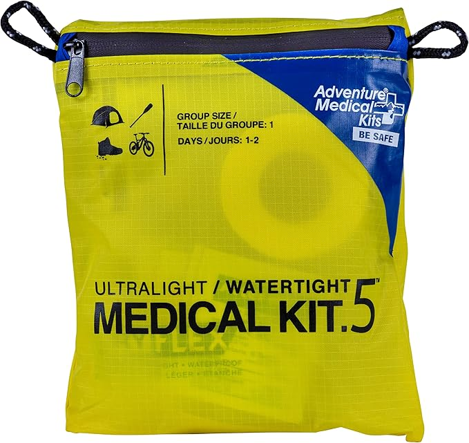
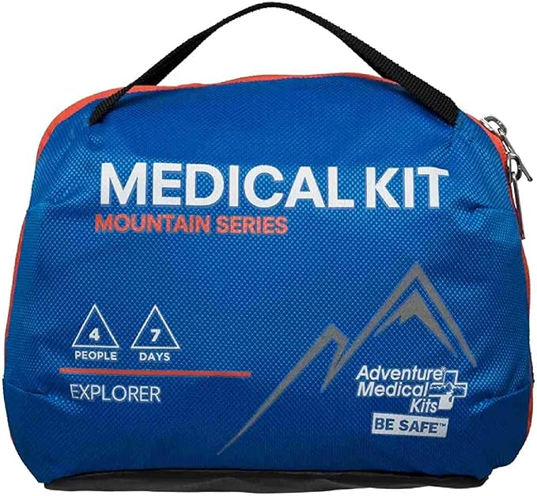
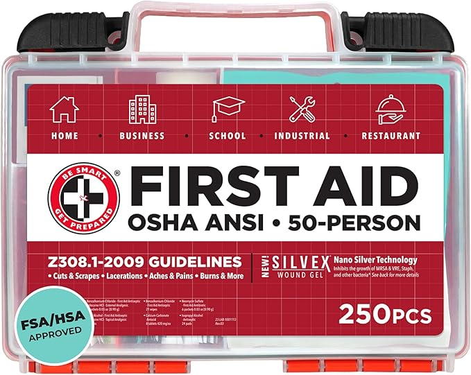
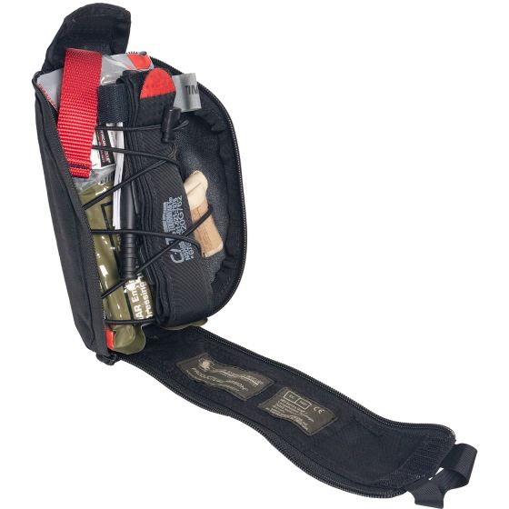
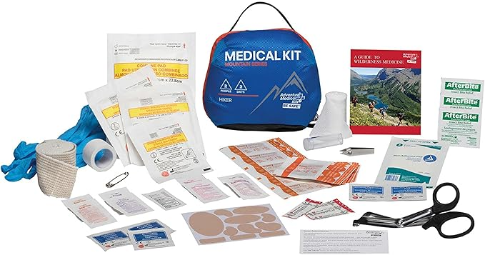
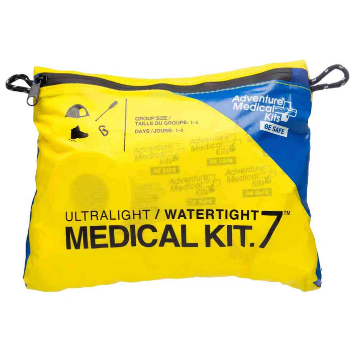

## Bottom Line, Up Front

-   The most important item in any first aid kit is your training. The first thing you should get is a First Aid class, at a minimum. _See more about_ **[Training](#training-deep-dive)**.
-   Choose your kits based on the likelihood of specific injuries, proximity to medical care, and number of people.
-   Most kits do not contain a tourniquet or other additions I consider essential.
-   For **[daily carry](#dailycarry)**, I recommend the [Adventure Medical Kits Ultralight/Watertight Medical Kit – .5](https://adventuremedicalkits.com/products/ultralight-watertight-medical-kit-5) with [a few additions](#additions).
-   For your **vehicle**, I recommend the [Adventure Medical Kits Mountain Series Medical Kit – Explorer](https://amzn.to/45ZeQxA) with a few additions.
-   For home use, I recommend [Be Smart Get Prepared OSHA/ANSI First Aid Kit](https://amzn.to/4mAkiOE) or a similar style kit.
-   For bleeding control, I recommend the [North American Rescue Eagle IFAK](https://www.narescue.com/eagle-ifak-kit-options.html).
-   For everyday recreation, I recommend the [Adventure Medical Kits Mountain Series Medical Kit – Hiker](https://amzn.to/4nbV88Z).
-   For most [backpacking/mountain biking/outdoor recreation](#backpack), I recommend the [Adventure Medical Kits Ultralight/Watertight Medical Kit – .7](https://adventuremedicalkits.com/products/ultralight-watertight-medical-kit-7) with numerous additions.

## Kit Recommendations

### Daily Carry

You don’t know when you’ll need basic first aid supplies—for yourself or for others. Having the simple supplies to treat minor illness or injury readily available can be incredibly convenient, which is why I always have a small first aid kit in my bag/backpack.

### The best first aid kit for daily carry

[Adventure Medical Kits Ultralight Watertight .5](https://amzn.to/45Io6ri)

Compact, lightweight, and waterproof with most of the essentials needed for outdoor emergencies. Recommend adding finger-tip/knuckle bandaids, common OTC medications, and possibly a thermometer.

[

Purchase on Amazon

](https://amzn.to/45Io6ri)

This is the kit I’ve carried for years, with a few modifications. I take the roll of tape out and wrap it around the small canister used to hold the tweezers/safety pin, and then I add a few things. First off, I always have a few fingertip and knuckle bandaids. For cuts/scrapes on your fingers, these are invaluable. Second, I always add a few small travel-sized medication tubes with some common OTC meds I like to have on hand. The kit comes with ibuprofen and acetaminophen, but I like to add naproxen (Alleve) because it lasts much longer and works better for certain situations (like the severe headaches I sometimes get). I also add some ephedrine (Sudafed, the stuff you have to get from behind the pharmacy counter). I prefer the extended release variant, which lasts all day. This is the best decongestant you can get. The pseudoephedrine decongestants stocked in the pharmacy aisle don’t work. Finally, I add some generic Tylenol Severe Cold and Flu because that’s my goto for any kind of upper respiratory virus/cold. I used to also carry cetrizine (Zyrtec) for seasonal and pet allergies, but haven’t needed it since starting prescription anti-allergy medications through Allermi.

### Vehicle First Aid Kit

### The best first aid kit for your vehicle

[Adventure Medical Kits Mountain Series Medical Kit – Explorer](https://amzn.to/45ZeQxA)

Comprehensive set of supplies in an easily organized kit that makes it quick to get what you need. Recommend adding better trauma shears and a thermometer.

[

Purchase on Amazon

](https://amzn.to/45ZeQxA)

Your vehicle is your home away from home—a place where you can keep more robust first aid supplies than you’d carry easily with you. For this, I recommend the Adventure Medical Kits Mountain Series Explorer. While this is designed for wilderness adventures, I value the organization this kit adds. The layout is exceptional and makes it quick and easy to access whatever supplies I need in the moment. The whole kit is compact and self-contained in a fairly rugged case.

Where you place a vehicle first aid kit does matter. A kit with enough supplies probably won’t fit in the glovebox. Placing the kit under a seat may make it hard to access conveniently if you have passengers or cargo. In my Jeep, this kit fits great in a side cubby in the back, where it is always easy to get to even if I have the back filled with stuff. In our minivan, it fits great under the center console, making it easy to access from the front or the back. When I had a car, it actually fit in the glovebox just fine.

I do recommend adding better trauma shears and a thermometer. See below for more information on additions.

### Home First Aid Kit

### The best first aid kit for your home

[Be Smart Get Prepared OSHA/ANSI First Aid Kit](https://amzn.to/4mAkiOE)

Relatively well organized and comes ready to hang in a convenient location. This kit covers most of the basics with plenty of supplies. I add a tube of antibiotic ointment, and you should also have some common OTC medications and a thermometer.

[

Purchase on Amazon

](https://amzn.to/4mAkiOE)

A home first aid kit should be readily accessible and have room for the common supplies needed for minor injuries. OSHA/ANSI workplace kits do a good job of meeting these objectives. I like this kit for its organization and the wall hook it comes with to make mounting it in a convenient spot easy.

For most people, the best location for a first aid kit is in the kitchen. This is a central area in the home, and the one place where you’re most likely to cut yourself, needing a bandage. Ours is mounted on the wall inside the pantry. I prefer the wall-mounted options because they are much less likely to end up with stuff on top of them or in front of them, blocking access in an emergency.

While this kit does come with single-use packets of antibiotic ointment, it makes sense to add a tube of antibiotic ointment. You should also have common OTC medications and a thermometer somewhere in your home. I think a good starter list of medications should include ibuprofen (Motrin), acetaminophen (Tylenol), cetrizine (Zyrtec), diphenhydramine (Benadryl), loperamide (Immodium-AD, an anti diarrhea medication), famotidine (Pepcid, for gastric reflux/heart burn), Tums, and Sudafed (ephedrine, not psuedoephedrine). For coughs/colds, I rely on the generic Tylenol Severe Cold and Flu along with extended release Sudafed. If you have young children, having the appropriate formulations of liquid Tylenol, liquid Motrin, and liquid cetrizine (Zyrtec) is a good idea. Benadryl isn’t usually recommended for young children. You should also have a thermometer.

### Trauma/Bleeding Kit (IFAK)

### The best bleeding control kit

[North American Rescue Eagle IFAK](https://www.narescue.com/eagle-ifak-kit-options.html)

Has all the essentials sourced from reputable manufacturers and packaged in a quickly accessible pouch that is easy to mount on a bag.

[

Purchase from North American Rescue

](https://www.narescue.com/eagle-ifak-kit-options.html)

First aid kits typically don’t include a tourniquet or hemostatic gauze. Tourniquets can be truly life-saving. It is possible to lose so much blood from some injuries that you’ll die before first responders can get to you. These aren’t just for gunshot wounds either—I’ve had numerous patients who needed a tourniquet after cutting themselves on broken windows, with saws, or just from a fall onto something sharp.

An IFAK (Individual First Aid Kit, a military term) or bleeding control kit should contain a tourniquet as well as a compression dressing, regular gauze, hemostatic gauze, and a chest seal. For those with adequate training, a chest decompression needle and a nasal airway are good additions to round out the minimum necessary equipment for keeping the airway open and fixing tension pneumothoraces.

Do not buy a tourniquet from Amazon. There are tons of counterfeit tourniquets out there, and those often fail when applied correctly to a patient. Buying directly from a company like North American Rescue ensures you are getting the real deal that will work when you need it to.

### Recreational Activities

### The best first aid kit for everyday recreation

[Adventure Medical Kits Mountain Series Medical Kit – Hiker](https://amzn.to/4nbV88Z)

A compact kit that makes finding the right items quick and easy. Great option for most day-to-day recreational activities, and the kit that I’ll throw in the stroller or backpack for

[

Purchase on Amazon

](https://adventuremedicalkits.com/products/ultralight-watertight-medical-kit-7)

This kit goes in our stroller or backpack for day trips—think outings at the zoo or trips to the park. It covers all the basics, and is easy to find things in. The compact size makes it ideal for quickly grabbing and carrying.

### Backpacking/Mountain Biking/Outdoor Activities

These activities are generally characterized by a combination of being further from medical help, having an increased risk of certain injuries such as broken bones, and often requiring leaving an area on foot to get to help. A good first aid kit is essential for these activities—but don’t forget having a survival kit as well.

### The best first aid kit for hiking, mountain biking, and the outdoors

[Adventure Medical Kits Ultralight/Watertight Medical Kit – .7](https://adventuremedicalkits.com/products/ultralight-watertight-medical-kit-7)

Compact, lightweight, and waterproof with most of the essentials needed for outdoor emergencies. Recommend adding a SAM splint, SWAT-T tourniquet, QuickClot gauze.

[

Purchase on Amazon

](https://adventuremedicalkits.com/products/ultralight-watertight-medical-kit-7)

The primary injuries likely encountered in most outdoor activities are simple cuts, scrapes, blisters, and splinters. Having a variety of bandages, gauze, moleskin, and tape covers most of your needs. For outdoor activities, having a waterproof kit is essential. This kit covers those basics and includes the common meds you need to treat pain as well as allergic reactions.

More severe injuries are possible—broken bones and dislocated joints, primarily, along with some risk of more severe cuts or puncture wounds. Unless you’re hunting, the risks of a gunshot wound or similar major penetrating injury is lower. I augment my kit with a SAM splint (because I really don’t want to have to walk out of the woods cradling a broken arm), a SWAT-T tourniquet for major bleeding control, and QuickClot gauze for bleeding control. To help with space, I wrap the cloth tape around the tube that holds the splinter/tick remover forceps and safety pins, and I remove the duct tape.

#### You Also Need a Survival Kit

Having a first aid kit is only the first step in being prepared. I also always have a small survival kit, aimed at being able to survive potentially harsh environments for at least overnight. When building a survival kit, a good place to start is the Ten Essentials. For daytrip or overnight outdoor activities, that kit includes:

**Navigation**: A small baseplate compass, a printed map (if available), and a GPS. Also my phone with a battery pack (for trips longer than a few hours).

**Lighting:** A small, durable flashlight and a mini-LED light.

**Communication:** A signal mirror and whistle are good to have; if I anticipate being further out, a ham radio.

**Sun protection:** Sunscreen and SPF lip balm.

**First Aid/Medical:** The first aid kit above, along with insect repellent and an ID/medical card.

**Knife:** A Mora knife is an excellent survival knife; this is augmented by my daily carry pocket knife and, if biking, a bike tool kit.

**Fire:** Always have at least two ways to start a fire. My basic fire-starting kit includes a lighter, tinder, and a ferro rod (that I can strike using the knife).

**Shelter**: A heavy-duty trash bag doubles as a poncho; the [SOL Emergency Bivy](https://amzn.to/3Ihj9wo) provides excellent protection against hypothermia and is lightweight and compact.

**Food**: The best preparation is to get good at fasting and functioning fasted. But having a couple of high-calorie protein bars is also good.

**Water**: Electrolyte powder (I like LMNT, but there’s other great options) and water purification tabs.

**Clothing**: Depending on the weather, packing a warm hat, jacket, gloves, or other extra clothing is smart.

See more on my post on [Survival Kit Recommendations](/guides/survival-kit-recommendations/).

### Recommended Additions

While these first aid kits are robust, they often lack some key items I almost always add:

-   **Trauma Shears:** None of these kits have serious trauma shears in them. If they have shears, they are flimsy and weak. I recommend something like [these](https://amzn.to/480DQam), although most trauma shears you’d find on Amazon are plenty adequate. Trauma shears are essential for cutting clothing to access a wound site, and you want some solid ones. I do love my Leatherman Raptors, and I think they are hard to beat for straight-up cutting performance, durability, and overall quality. But its hard to recommend those to anyone who wouldn’t be using it routinely for work.
-   **Thermometers:** I include the [Vicks SpeedRead digital thermometer](https://amzn.to/3JEa9C6) in many of my first aid kits. its helpful to know if someone is having a fever or not, and these are inexpensive, super small, and reliable.
-   **Narcan:** I actually don’t have any Narcan yet, but this would be a great thing to add to your kit. Available as a nasal spray, this medication reverses the effects of opioid overdoses and can be truly lifesaving.
-   **Hemostatic Gauze:** This stuff is expensive, so I’m not using it on run-of-the-mill cuts and scrapes. But for serious hemorrhage, this is like magic—it speeds up blood clotting. There’s several brands out there, but the one I reach for is QuickClot.

## Deep Dive

### Preface

A first aid kit is only useful if it is **CLOSE** at hand when an emergency happens, **EASY** to open and find what you need, and **STOCKED** with the right supplies for the situation.

Furthermore, a first aid kit provides you with the supplies and tools—you have to bring the knowledge and critical thinking.

> The most important item in any first aid kit is your training. The first thing you should get is a First Aid class, at a minimum.

If you’ve got the training, have decent problem-solving skills, and can stay calm, you can improvise your way through almost any medical emergency. If you don’t have these, you’ll struggle with even the fanciest first aid kit.

What you put in a first aid kit should be based around

### What Kind of Training Should You Get?

At a minimum, look for a course from a reputable sponsoring organization that includes hands-on skills training and covers First Aid, CPR, AED use, and covers both adults and children. American Red Cross, American Heart Association, and ECSI all provide excellent courses. You also want to make sure the course covers opioid overdoses.

You should also look for some form of a “Stop the Bleed” course—American Red Cross calls theirs the “FAST” first aid class. Stop the Bleed is a nationally standardized curriculum focused on rapid control of life-threatening bleeding from gunshot wounds or major cuts and stabbing wounds. While oriented towards active shooters/IMCI[^1] events, the same techniques apply for a wide range of less dramatic causes of injury. While I’ve applied tourniquets and done aggressive bleeding control in plenty of violent assaults and shootings, I’ve probably used these treatments at least as often for workplace injuries (for instance, don’t use a circular saw above your head while on a ladder!) and accidental cuts (for example, maybe its not a great idea to clean a large glass aquarium while drunk).

If you want to get more training (which I definitely recommend):

-   **If you do a lot of outdoor recreation:** Wilderness First Aid provides a lot of useful training specifically oriented around handling emergencies that occur while in the outdoor/wilderness environment without rapid access to 911 first responders. ECSI has an exceptional Wilderness First Aid course, however, the gold standard here is probably NOLS.
-   **If you shoot guns a lot or are otherwise interested in a more “tactical” training course:** TCCC (Tactical Combat Casualty Care) from NAEMT is the standard military medical training course. For civilians, a variant called TECC (Tactical Emergency Casualty Care) is more applicable. These courses don’t replace a general first aid/CPR/AED course, but they do provide a lot more training specifically to handling major injuries.
-   **If you want even more training:** Look for an Emergency Medical Responder (EMR) course. This is typically a 50–60 hour course taught over 2–4 weeks and is professional-level training with a greater focus on assessment, understanding different injuries, and more hands-on skills.

### Selecting a First Aid Kit

The choice of a first aid kit depends on the **ACTIVITIES** you’ll be using it for, how many **PEOPLE** you need to care for, and your **PROXIMITY** to medical care and/or resupplies; your **SKILL LEVEL** also may play a role in this as well.

Different activities have different risk profiles as well as specific constraints on what you can carry. For instance, the range of likely injuries while mountain biking are different than what you’d encounter in your kitchen, and the amount of space you have for carrying equipment is much more limited compared to what you can fit in your kitchen cabinet.

I have a strong preference for Adventure Medical Kits because of the quality of their kits over the years. Their bags are well-made, the kit organization makes sense, and the supplies themselves are excellent.

[^1]: IMCI: Intentional Mass Casualty Incident. The current professional terminology for an event like an active shoot, mass stabbing, or terrorist attack.
