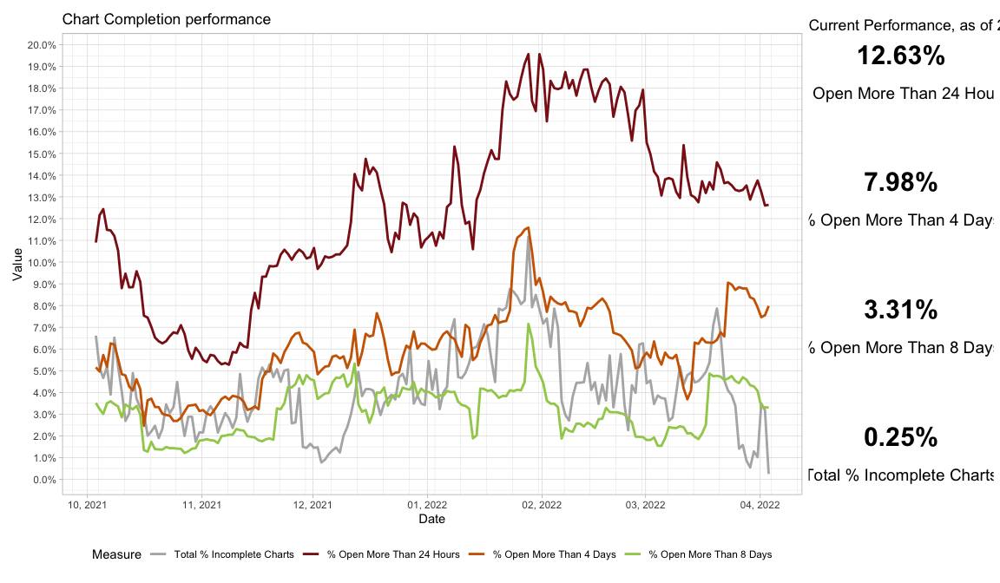
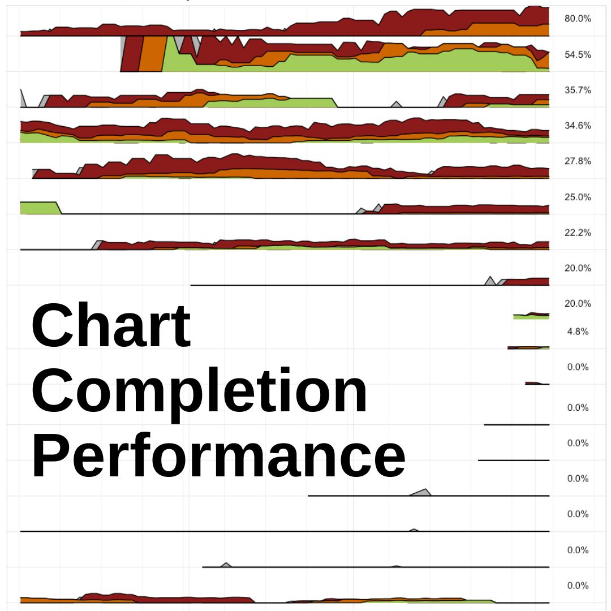
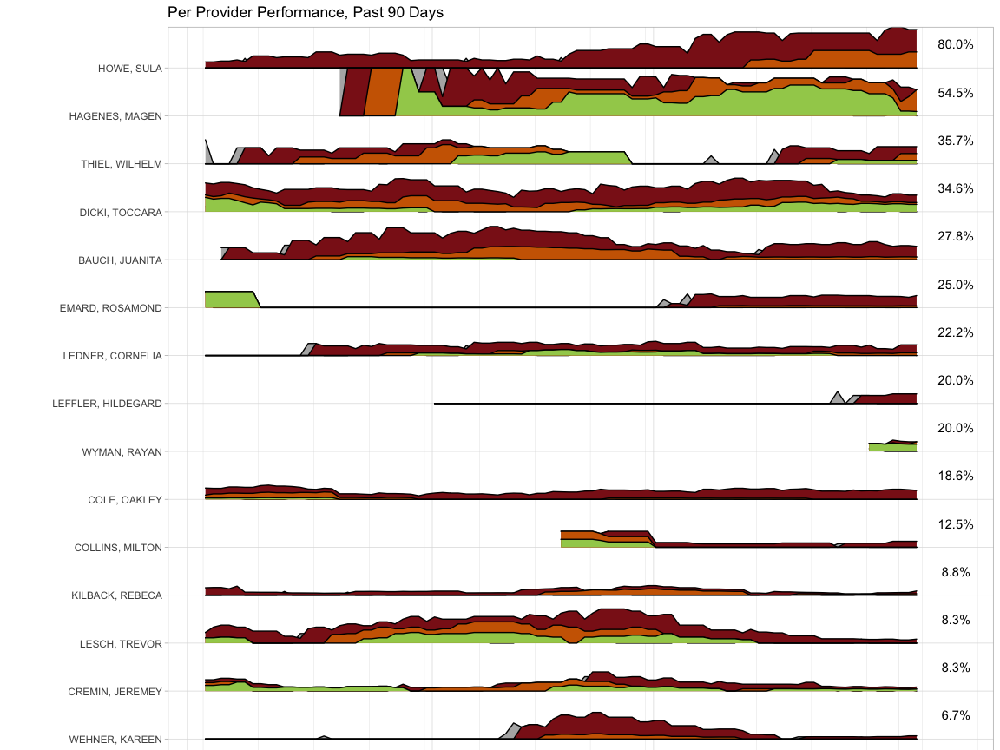
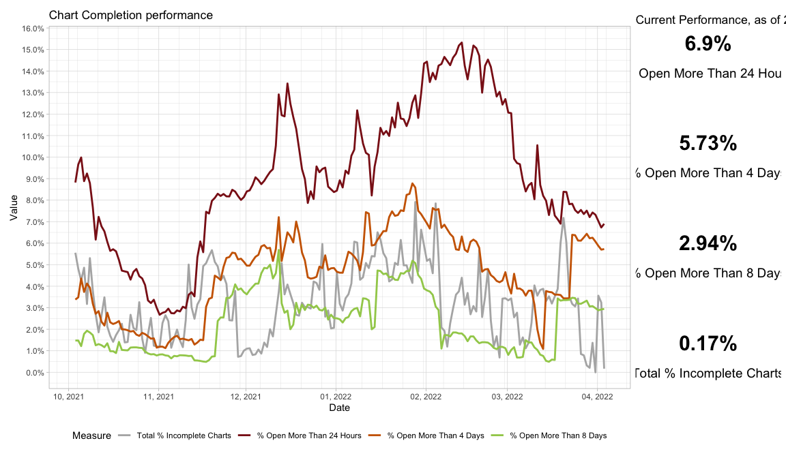

## Rationale

Documentation (charts) should be completed promptly, ideally within 24 hours. Delays in completion result in greater risk for documentation errors, incomplete information provided for ongoing care, delays in billing collection, and lost revenue. Staff typically work on a four-day rotation, so the key measures are the percentage open more than 24 hours, more than four days, and more than eight days. The numerators are the number of charts open for each period, and the denominator is the number of charts started within the past thirty days.

### Key Visualization

The key visualization charts these rates on a day-by-day basis using rolling 30-day windows. The graph also highlights the most reecent rate numbers in individual callout gems on the right. This chart is useful when correlated with knowledge of external events to understand what interventions drive significant improvements.

Looking at individual employees highlights which individuals have substantially worse performance as well as to understand individual performance over time. This can be correlated with external events, such as training periods, times of external stress such as illnesses or divorces, and individual work loads. An individual with a season of poor performance correlated with an external stressor that self-resolved is typically not someone that needs additional help, while an individual with significant poor performance likely needs help to catch up and coaching to avoid getting behind in the future.

### Project Meta

**Tools Used:** PowerAutomate, R, R Markdown notebook, Tidyverse.

[See this project on GitHub](https://github.com/samuelkordik/ChartCompletionViz)

**_About this visual_**

This visual combines a line chart showing rates over time with key performance indicators highlighting immediate, recent changes. This was accomplished by building out separate plot objects in R and combining them with the patchwork library. The resulting plot is automatically saved as a high-resolution PDF.

Using this approach can identify the worst performers, and these can be removed to get a better sense of the overall performance.

### Project Impact

The key visualization prompted us to analyze what factors potentially led to both the noticeable decline in defects and the gradual increases. These insights helped identify the most effective approach to improving quality on these measures. The per employee data was also helpful in identifying specific individuals who could benefit from hands-on measures.

The visuals were run repeatedly for several months and changes (especially in individual employee performance) became abundantly clear as their plots improved.

_**About the visualization**_

Ridgeline plots are a unique application of a stacked area chart; these visualize individual employee performance over time and allow for comparisons of employees. Like the plot above, this visual also includes key metrics to the right.
