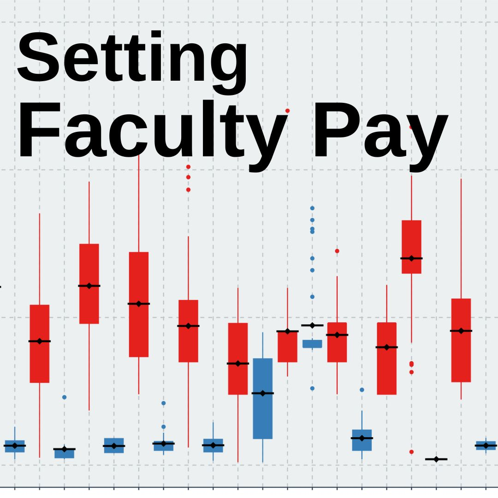
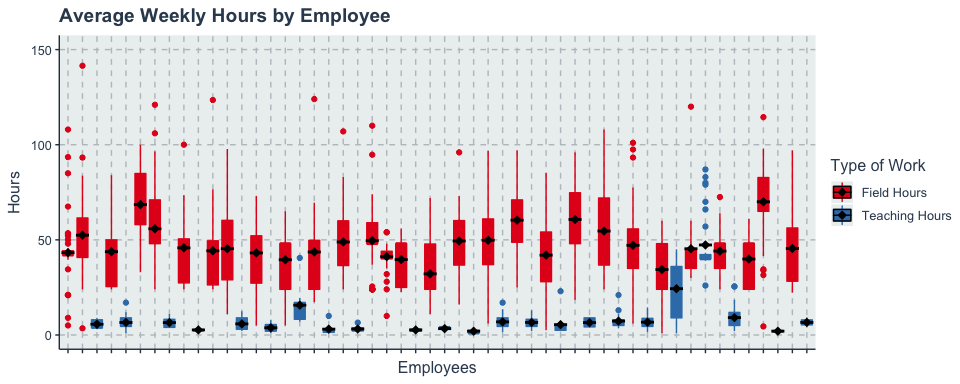
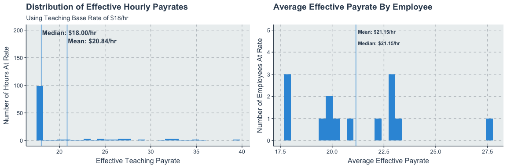
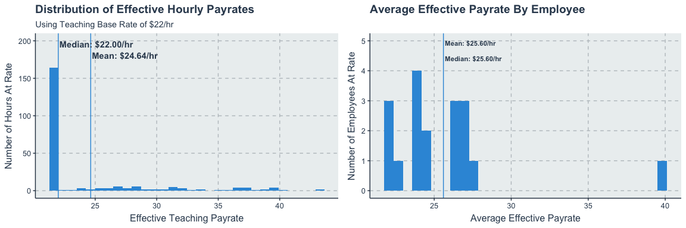
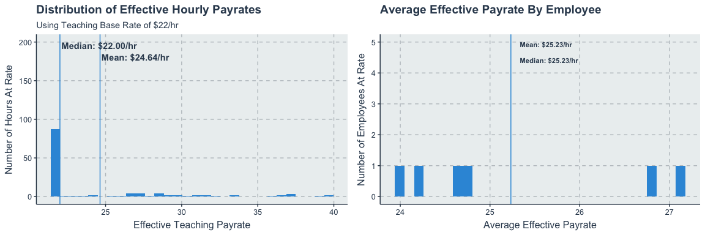
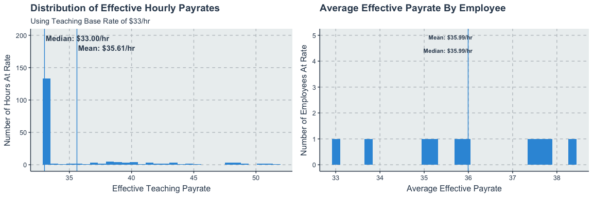
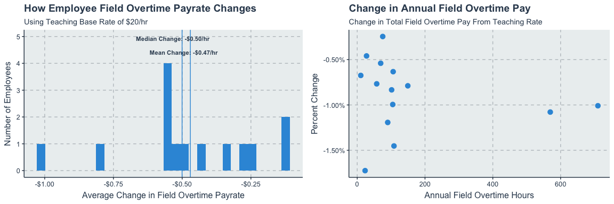
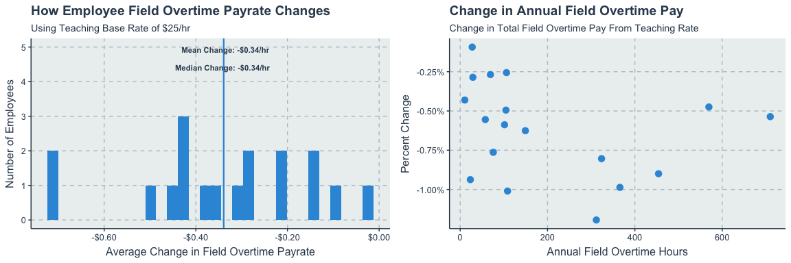
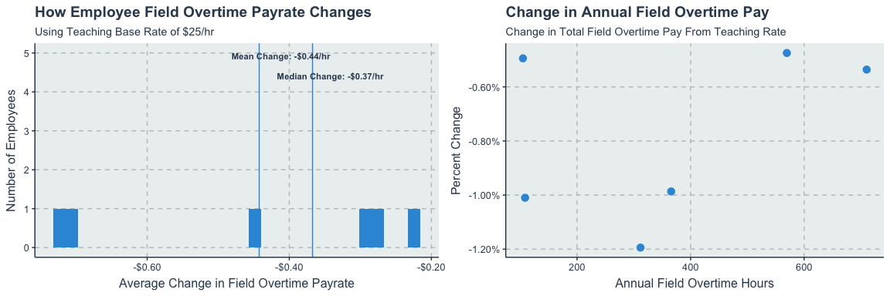
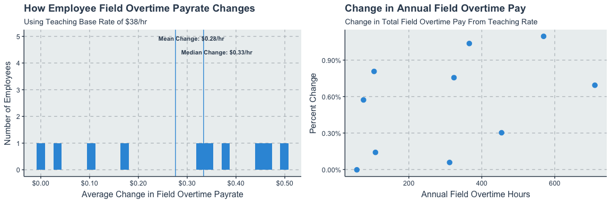

This project analyzed historical payroll data to determine effective part-time pay rates to match market pay. Many of our faculty members taught on the side but were full-time employees in our organization in other departments. We realized that they should be fairly paid for teaching; however, their pay had been based on their full-time roles and didn’t reflect their responsibilities or competency as an instructor. Furthermore, the wide variation in their regular pays complicated budgeting for education labor costs. Setting an extra-duty pay rate was complicated by the requirement to pay it as _blended overtime_ (a weighted average of wages worked). This project leveraged past data to determine optimal future teaching pay rates.

### Identifying Market Pay Rates

We identified four types of teaching positions, and then completed an informal market survey to determine what our ideal target pay rate would look like. We proposed four types of teaching positions:

#### CPR Instructor

Responsible for teaching CPR, AED, and First Aid courses (including Wilderness First Aid). Requires CPR instructor certification. Market pay rates vary widely, but appear to generally be $15-20/hour in the Houston market.

**Target pay rate for CPR Instructor:** $20 /hr.

#### CE Instructor

Responsible for teaching continuing education courses, including standardized “card courses” from AHA and NAEMT, such as ACLS, ACLS-EP, AMLS, PHTLS, and PEPP. Typically requires EMT or Paramedic certification along with course-specific instructor certification. Market pay rates are typically $16-20/hour, depending on type of course and experience.

**Target pay rate for CE Instructor:** $25 /hr.

#### EMT Skills Instructor

Responsible for teaching lab skills and scenarios for EMT Basic courses. Requires a minimum of an EMT-Basic certification. Skills instructors are provided with lesson plans, skill sheets, and background information. Market pay rates vary more widely for this role, but seem to range from $18-25/hour, with most positions paying at the lower end of this range.

**Target pay rate for EMT Skills Instructor:** $25/hr.

#### Adjunct Faculty

Responsible for planning, developing, and teaching EMS classes in a given curriculum. Market pay rates vary but some price points include $20, $31, and at the high end, $47.66/hr.

**Target pay rate for Adjunct Faculty**: $38 /hr.

### Analyzing pay rate as overtime

We calculated the effective pay rate (the combination of base pay plus overtime pay) based on the previous year’s actual work by instructors and their current field pay rates. The historical schedule data included 4,892 shifts for 30 instructors; the average employee worked three field shifts and one teaching assignment per week, with a median of 48 hours (IQR 48-48) in the field and 4 hours (IQR 1-7) teaching each week. As can be seen in this graph, two employees had median weekly teaching hours above 20 due to light-duty assignments coded to our department, and we excluded these from the analysis.

### Project Meta

**Tools Used:** R, R Markdown notebook, Tidyverse.

[See this project on GitHub](https://github.com/samuelkordik/FacultyPay)

Boxplot visualization of average weekly hours by employee

Any hours worked over the first forty hours in a week counts as overtime.

Depending on when in the week the employee taught, that resulted in different allocations of overtime to field or teaching. As can be seen below, teaching hours rarely resulted in overtime pay. This is not unexpected; a typical employee might work one 24 hour shift on a Sunday or Monday, and then not work their next shift until Thursday or Friday. Since classes are almost always on weekdays, this would put almost all teaching assignments before the employee hits 40 hours in the week.

Dot plot visualization of media weekly hours by employee, categorized by overtime and straight pay.

Pay is then analyzed for each employee and effective pay rates are determined by including the effects of blended overtime. This was done by identifying the employees in the dataset that might do each job, then recalculating their pay based on a new extra duty pay rate for teaching. The results were then visualized in two ways. Visualizing the pay rate (base pay plus blended overtime) by the number of hours worked helps ensure that most employees are getting paid similarly. Visualizing the effective pay rate by employee number also helps ensure this. Both visualizations aid in confirming that the identified base rate will achieve close to the desired target pay rate identified above.

CPR Instructor

**Target pay rate for CPR Instructor:** $20 /hr.

CE Instructor

**Target pay rate for CE Instructor:** $25 /hr.

EMT Skills Instructor

**Target pay rate for EMT Skills Instructor:** $25/hr.

Adjunct Faculty

**Target pay rate for Adjunct Faculty**: $38 /hr.

### Effects on Field Overtime Pay

Any changes to teaching pay rates would impact the employee’s overtime pay assigned to their full-time role. Understanding the degree of this change was critical to gain buy-in from other departments in setting the new pay rates. Most of this impact occurs when an employee works several hours teaching early in the week, pushing their regular shifts later in the week into unexpected overtime.

_**About the visualization**_

Box plots are one of the most effective tools for understanding the distribution of data points, the median, and outliers. Graphing box plots for each category (in this case, each employee) allows for a quick understanding of the distribution of hours for the employees as a group. This works best when the number of categories is a manageable number to see, ideally fewer than fifty.

CPR Instructor

**Target pay rate for CPR Instructor:** $20 /hr.

CE Instructor

**Target pay rate for CE Instructor:** $25 /hr.

EMT Skills Instructor

**Target pay rate for EMT Skills Instructor:** $25/hr.

Adjunct Faculty

**Target pay rate for Adjunct Faculty**: $38 /hr.

### Project Impact

Changing pay rates can be challenging in an organization, especially when the impacts will be felt across multiple departments. This data analysis helped this move by both calculating the best pay rate to achieve fair market pay and providing proof that these rates would be effective with minimal downside. The latter was critical for getting buy-in from other department managers and Human Resources.

Ultimately, this project was key for accomplishing the aim of changing these pay rates. This ultimately resulted in being able to better budget for courses. Additionally, this change reduced problems caused by unfair pay for instructors and provided the structure to support growth and accountability for education staff.

_**About the visualization**_

The left side histogram aids in understanding the distribution of change in field overtime pay. This shows how many employees will be impacted by higher overtime rates, and the annotations highlight the mean and median change.

The right side scatterplot helps in understanding how the impact of the change plays out with those who work more field overtime hours. This graph also helps to identify if there are any correlations (which there shouldn’t be) or trends.
