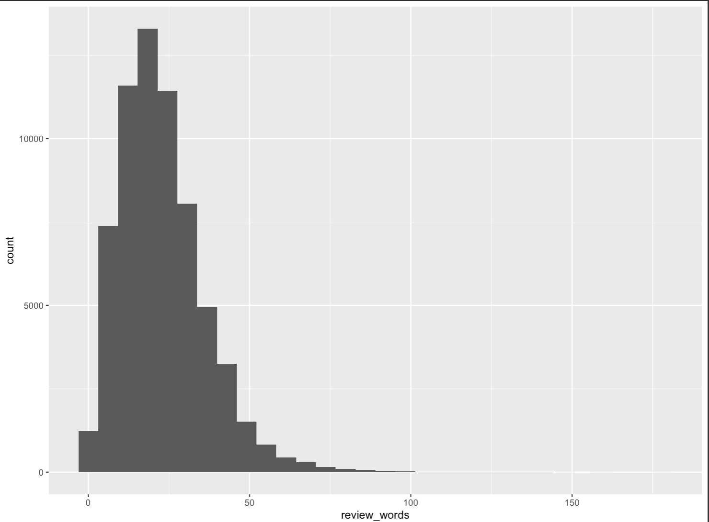
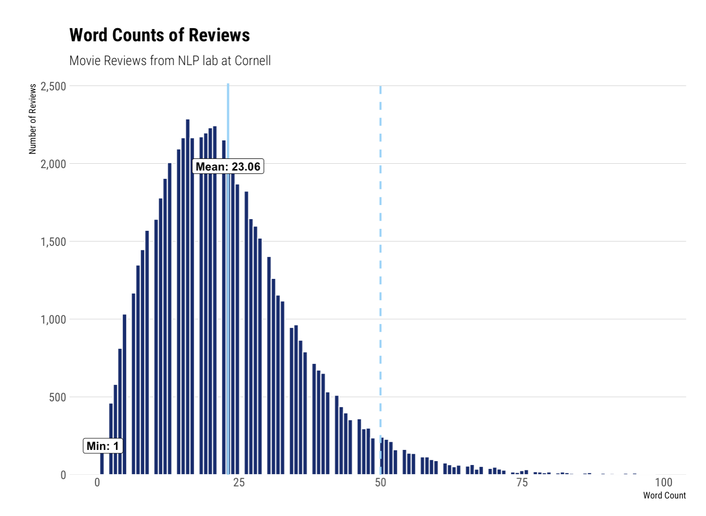

_Capturing this for my own future reference—and in case anyone else wants to create better histograms._

The default ggplot histogram is functional but boring. Here’s a histogram showing the number of words in a set of movie reviews[^1].

```r
review_stats |> ggplot(aes(review_words)) + geom_histogram()
```



Functional? yes. And yet also really pretty ugly.

I decided to do better and assemble a function that extends ggplot with an opinionated, better histogram.

```r
review_stats |> better_hist(aes_x = review_words,
                           label_args = list(title = "Word Counts of Reviews",
                                             subtitle = "Movie Reviews from NLP lab at Cornell",
                                             x = "Word Count",
                                             y = "Number of Reviews"),
                           add_mean = TRUE,
                           add_sd = 2)
```



The full code is in a GitHub gist [here](https://gist.github.com/samuelkordik/e9d096d8234c1b94060b271b5c531e32).

Functionally, this function starts by calculating binwidth using the Freedman-Diaconis method. It can also (optionally) calculate density. We add labels for minimum, maximum, and mean, then style using the hrbrthemes theme\_ipsum\_rc. Lines for mean and standard deviations can aso be set.

Creating functions for this kind of work is immensely useful as it enables you to generate rich graphics with a consistent set of styling easily. This is the ideal sort of thing to include in a [personal R package](https://www.jumpingrivers.com/blog/personal-r-package/).

[^1]: Movie Review Data from Cornell: [https://www.cs.cornell.edu/people/pabo/movie-review-data/](https://www.cs.cornell.edu/people/pabo/movie-review-data/)
